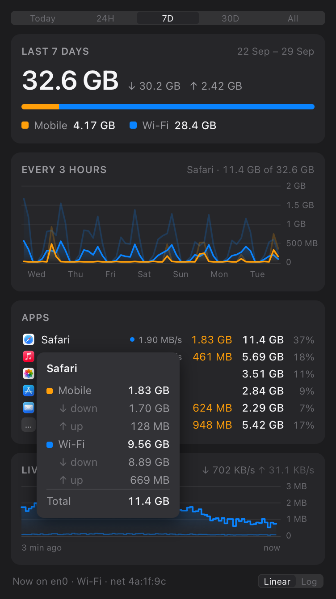
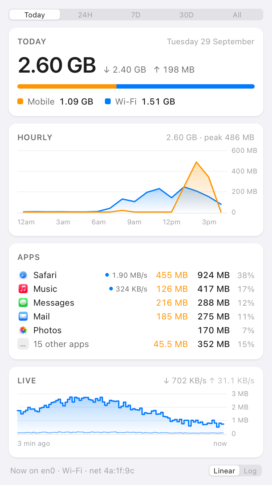

# data-usage

[](https://github.com/Carlos-err406/data-usage/actions/workflows/ci.yml)

Live network data usage in the macOS menu bar, split by **mobile** vs **Wi-Fi**,
resetting daily and keeping history for graphs.

A single 1.4 MB Rust binary that runs as a [SwiftBar](https://swiftbar.app)
plugin. No app bundle, no code signing.

<p align="center">
  
  
</p>

<p align="center"><sub>Demo data.</sub></p>

- **Menu bar** — live throughput, e.g. `↓1.2M ↑340K`, refreshed every 2 seconds
- **Left-click** — the popover: totals, a history chart and the apps that used
  the most, for today, 24 hours, 7 days, 30 days or all time; and live
  throughput. Hovering any period or app gives the exact split
- **Right-click** — *Count this network as Mobile*, *Back to automatic*,
  *Reveal database*

## Install

Requires [SwiftBar](https://swiftbar.app) and a Rust toolchain:

```bash
brew install --cask swiftbar
```

Then:

```bash
curl -fsSL https://raw.githubusercontent.com/Carlos-err406/data-usage/main/install.sh | bash
```

That fetches the source into a temporary directory, builds it, and installs the
binary to `~/.local/bin/data-usage` with a plugin wrapper in your SwiftBar
plugin folder. Open SwiftBar, or pick **Refresh All** from its menu, to load it.

The same script works from a checkout, where it builds in place instead:

```bash
git clone https://github.com/Carlos-err406/data-usage.git
cd data-usage
./install.sh
```

## How mobile data is detected

Three signals, in order of preference.

**1. Cellular interface.** A real cellular modem reports
`nw_interface_type_cellular` and is always counted as mobile.

**2. `expensive`.** `Network.framework` raises this for an **iPhone** Personal
Hotspot, over Wi-Fi *and* over USB. It's the same signal macOS uses to hold back
iCloud sync and App Store downloads.

It does **not** fire for an Android hotspot — verified against a Samsung phone,
which presents as an ordinary access point and reports `expensive=false` on both
Wi-Fi and USB tethering. Apple raises the flag from its own device signalling,
so treat it as an Apple-only convenience.

**3. `constrained`, i.e. Low Data Mode.** This is the native signal that works
for *any* phone. macOS lets you mark an individual Wi-Fi network as Low Data
Mode in **System Settings → Wi-Fi → Details… → Low Data Mode**, which sets
`constrained` on that path, and this app counts a constrained link as mobile.
It has the side benefit of making macOS itself throttle background traffic on
that network.

Reading the Wi-Fi **SSID** would be the obvious alternative and is deliberately
avoided: it triggers a Location Services prompt on macOS 14+.

### Pinning a network by hand

**Count this network as Mobile** / **as Wi-Fi** pins it; **Back to automatic**
clears the pin.

Pins are keyed on the **network**, not the interface. A laptop reaches both home
Wi-Fi and a phone hotspot over the same `en0`, so an interface-keyed pin meant
for one would silently relabel the other.

The key is the default gateway's MAC address — stable per network, different for
every router and hotspot, and readable without any permission prompt. Until the
gateway answers ARP the menu shows *Identifying network…* rather than offering a
pin, because a key derived from the gateway IP would change to the MAC moments
later and orphan the pin.

## Which interfaces are counted

Only links `Network.framework` reports as physical: Wi-Fi, Ethernet, cellular.

That deliberately excludes `utun*` (VPN), `awdl0`/`llw0` (AirDrop), `bridge*`,
`ap1` and `lo0`. Excluding VPN tunnels matters most: tunnel traffic is *also*
counted on the physical interface carrying it, so counting both would double
every byte sent over a VPN.

## The popover

**Left-clicking the menu bar item opens a popover.** A row of tabs across the
top — Today, 24H, 7D, 30D, All — picks the timeframe for everything under it:
the total with its mobile/Wi-Fi split, a history chart, and the apps that used
the most. Below those, a live throughput chart, which is always the last few
minutes. Hovering any app or period gives the exact split. That is the whole
interface.

The history chart steps hourly for Today and 24H, in three-hour blocks for 7D,
daily for 30D, and for All whatever keeps a readable number of points. The ←
and → keys switch tabs, and the choice is remembered.

The live chart covers the last three minutes, one step per plugin refresh:
download filled and coloured by the class that carried it, upload as a lighter
line. Each refresh's bytes are spread over the seconds since the one before, so
a late refresh shows as one wide step at the average rather than a spike.
Hovering it gives the rates under the pointer, and keeps doing so as the chart
scrolls underneath.

The apps card follows the tabs too. Per-app tracking
started later than the totals, so where it covers only part of the timeframe
the caption says since when. It lists the five apps that
used the most, each with its icon, its share of the total, and any mobile use
as its own figure in orange; everything else is summed into one "Other" row,
so the rows add up. Apps busy right now show their current rate. Hovering an
app draws its usage on the history chart, over the whole traffic faded back —
so a spike can be pinned on whoever caused it. The rows keep their order as
apps go busy and quiet: a row moving under the pointer would change which app
the chart is showing.

Each chart draws one line per class, so mobile and Wi-Fi can be compared
directly, against labelled gridlines. **Linear | Log** in the footer switches
the scale: on a log scale each decade gets the same height, so a few hundred MB
of mobile stays readable beside tens of GB of Wi-Fi. Either way the top of the
scale is the round number just above the peak — 50 GB for a 43 GB peak, not
the next power of ten. Lines begin at the first
tracked period: before it there is no data, and a line along zero would claim
there was no traffic. Hovering an earlier period says it was not tracked yet.

The all-time chart gets coarser as history grows, so it keeps a readable number
of points: daily for the first 90 days, then weekly (Monday to Sunday) up to two
years, then monthly.

The menu bar title is a constant width — each rate right-aligned in a
four-character field of a monospaced font. SwiftBar sizes the item to its title
and anchors the popover to it, so a title that changed width would slide the
open popover sideways on every refresh.

**Right-clicking opens a short context menu** with the only things the popover
cannot do: pinning the current network's classification, and revealing the
database. A web page in SwiftBar's popover has no channel back to the plugin,
so actions have to be menu items.

That split comes from `barItemClicked`: on a left click SwiftBar runs the title
line's action first and only falls through to opening the menu if nothing fired.
So an `href=<url> webview=true` on the menu bar line reaches the popover in one
click, and the menu stays on right-click.

Hover has to live in a web view because an `NSMenuItem` image cannot report
which bar the pointer is over — AppKit hands the plugin no per-pixel hover, and
a menu row is the smallest unit it knows about. Giving the chart image an action
just highlights the whole row.

The page is written to `report.html` beside the database and loaded over
`file://`. Everything in it is inlined: the popover has no network access and
WKWebView is given no read access beyond the page itself, so an external
stylesheet or script would silently fail to load.

SwiftBar loads the page once per opening, but the plugin keeps running while
the popover is open and rewrites the file every refresh. So the page keeps
itself current: every second it loads the file again in a hidden frame, which
posts its data back to the visible page. That is the one way in: fetching the
file is refused, since the page may not read files, but navigating a frame to
the page's own file is allowed. The file is written aside and renamed into
place, so a frame never reads it half-written. Charts under a tooltip are left
alone until the pointer moves off.

## Which apps used it

`nettop` reports bytes per process with no privileges, but only while it runs:
run once, it sums the sockets open at that instant, so a download that starts
and finishes between two refreshes is never seen. Run continuously in delta
mode, it reports each process's bytes per interval, closed sockets included.

The plugin lives for milliseconds, so this runs as its own process,
`data-usage apps`, which each plugin run starts if it is not already going (an
`flock` on `apps.lock` keeps it to one). It runs one `nettop` for Wi-Fi and one
for wired links, and credits each app's bytes to the class of the link of that
type that is up, pins included. It exits on its own once the plugin has not run
for two minutes, or once a new install has replaced the binary, and the next
plugin run starts it afresh.

Two details keep it honest. `nettop` block-buffers into a pipe, so it writes to
a pseudo-terminal instead, which gets each sample as it is taken. And that
terminal is `nettop`'s controlling terminal, so however the helper exits —
killed outright included — the kernel hangs `nettop` up rather than leaving it
running.

Apps are named after their outermost app bundle, so Chrome's helper processes
count as Google Chrome, and by the name the app gives itself where it sets one.
A command-line tool is named along with the app macOS holds responsible for it
— `claude` in Ghostty — through a private but long-standing libSystem call,
looked up at run time so that its absence costs only that. A process that has
already exited when its traffic arrives takes the name its siblings had.
Icons come from each bundle's `.icns`, converted with `sips` (Quick Look's
`qlmanage` hangs without a window server session) and stored as small PNGs;
the page carries them inline, since it can load nothing but itself. Per-app
usage is kept in hourly buckets.

## Where the data lives

`~/Library/Application Support/data-usage/usage.db` — SQLite, WAL mode.

Usage accumulates into fixed 5-minute buckets keyed by class: 288 rows a day per
active class, small enough to keep indefinitely and fine-grained enough to draw
an hourly graph. "Resets daily" is a query boundary, not a destructive reset, so
yesterday and last month stay readable.

Beside them: each refresh's bytes for the last ten minutes, for the live chart,
trimmed as it goes; per-app usage in hourly buckets; the apps busy right now,
rewritten every couple of seconds; and each app's icon.

## Notes and limits

* **Accounting only happens while the plugin is running.** Traffic used while
  SwiftBar is closed is not attributed. On restart, a gap of up to an hour is
  caught up from the last checkpoint; anything longer resyncs silently rather
  than dumping hours of bytes into the current minute.
* Per-app figures are a breakdown, not the accounting. They come from `nettop`,
  which counts what each process sent and received, not the packet headers and
  retransmissions the interface counters include, nor traffic with no local
  process behind it, such as a virtual machine's. So the apps add up to a
  little less than the total. Traffic inside a VPN tunnel is on `utun*`, which
  is not watched, and shows up as the VPN client's.
* Interface counters reset when a link is torn down and rebuilt; a counter going
  backwards is treated as a reset, not as negative usage.
* Only one instance accounts at a time, guarded by an `flock` on
  `accounting.lock`. Every instance reads the same global kernel counters, so
  two accounting at once would each attribute the same bytes and inflate the
  totals by however many are running. A second instance still renders the menu,
  just from stored history. `data-usage status` reports which role it has.

## Implementation notes

Two plausible-looking sources of byte counters are wrong on macOS, both silently:

* `getifaddrs()` returns `struct if_data`, whose `ifi_ibytes`/`ifi_obytes` are
  32-bit and wrap every 4 GB.
* `sysctl(NET_RT_IFLIST2)` returns `struct if_data64`, which *should* be 64-bit —
  but the kernel leaves the high words zeroed on that path, so it wraps at 4 GB
  too. This one is particularly convincing because the struct and every other
  field in it are correct.

`net.link.generic.ifdata.<index>.general` is the one that carries true 64-bit
counters, and it's what `netstat -ib` agrees with.

Those structs also sit under `#pragma pack(4)`, which lands `if_data64` at offset
52 of `ifmibdata` — 4-byte aligned, not 8. A `#[repr(C)]` Rust struct re-aligns it
to 56 and reads garbage, so fields are read at explicit byte offsets.

## Commands

```bash
data-usage once                          # print one menu and exit (what the plugin runs)
data-usage stream                        # continuous mode; see the note below
data-usage status                        # link classification + who is accounting
data-usage apps                          # the per-app helper; the plugin starts it
data-usage set-class en0 mobile          # pin an interface
data-usage set-class en0 auto            # clear the pin
```

## Why a refresh plugin, not a streaming one

SwiftBar supports streamable plugins, which push updates continuously and would
give a smoother menu bar. It resets the menu item on every `~~~` block, though,
which dismisses the dropdown a second after you open it. A refresh plugin is
deferred while the menu is open, so it stays put. `stream` is still there, and
still has that flaw.

One refresh costs about 10 ms, and each run measures its delta against the
checkpoint the previous run left in the database, so accounting is continuous
even though nothing is.

## Development

CI runs on every push and pull request to `main`: `cargo fmt --check`, clippy
with `-D warnings`, tests, and a release build.

```bash
cargo fmt --all
cargo clippy --all-targets -- -D warnings
cargo test
```
